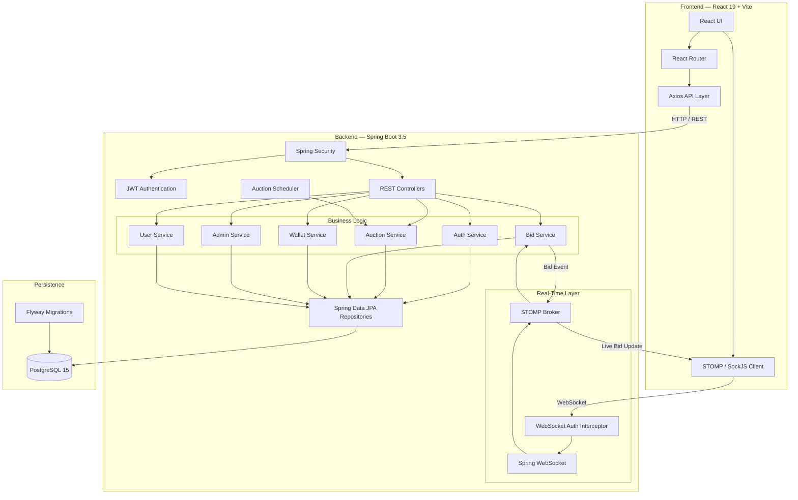
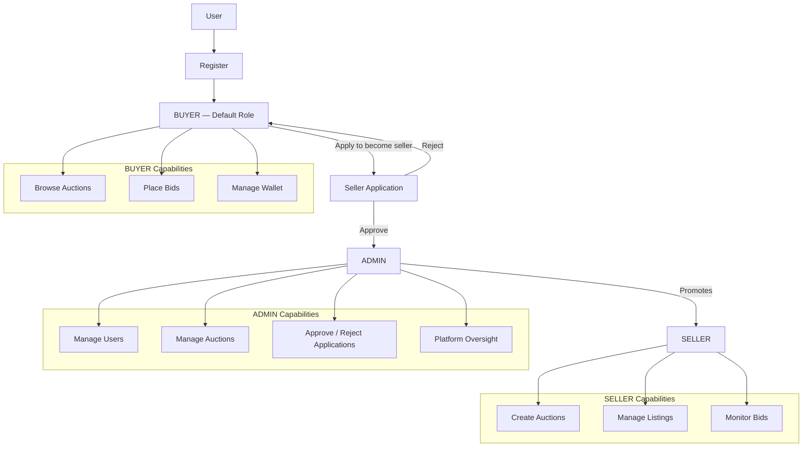
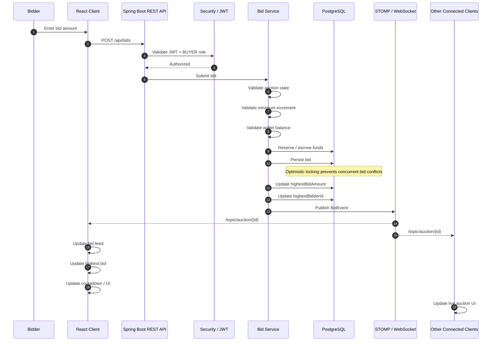
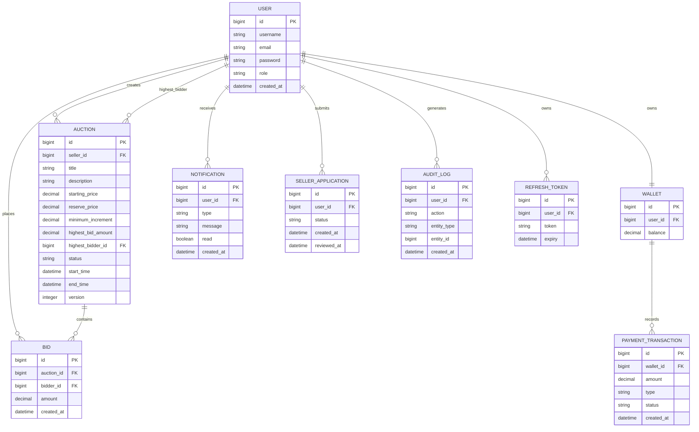

<div align="center">

# BidPulse

### A Full-Stack Real-Time Auction Platform

[](https://spring.io/projects/spring-boot)
[](https://react.dev/)
[](https://www.postgresql.org/)
[](https://stomp.github.io/)
[](https://openjdk.org/)
[](https://vite.dev/)
[](https://docs.docker.com/compose/)
[](LICENSE)

*Where every millisecond counts. Bid live, win instantly.*

</div>

---

## Table of Contents

- [Overview](#overview)
- [Features](#features)
- [Architecture](#architecture)
- [Tech Stack](#tech-stack)
- [Getting Started](#getting-started)
  - [Prerequisites](#prerequisites)
  - [Backend Setup](#backend-setup)
  - [Frontend Setup](#frontend-setup)
- [Project Structure](#project-structure)
- [API Reference](#api-reference)
- [User Roles](#user-roles)
- [Real-Time Bidding Flow](#real-time-bidding-flow)
- [Database Schema](#database-schema)
- [Contributing](#contributing)

---

## Overview

**BidPulse** is a production-grade, full-stack real-time auction platform that enables users to create, browse, and participate in live auctions. Built with a modern microservice-ready architecture, BidPulse delivers sub-second bid updates via WebSocket connections, enforces role-based access control, and manages a full wallet/payment lifecycle -- all wrapped in a sleek React-powered UI.

Whether you're a buyer chasing the thrill of a last-second win or a seller looking to maximize the value of your listings, BidPulse makes the experience fast, fair, and transparent.

---

## Features

### Live and Real-Time

- **WebSocket-Powered Bidding** -- STOMP over SockJS for instant bid broadcasts to all participants in an auction room
- **Live Countdown Timers** -- Server-driven auction end times with live client-side countdown
- **Real-Time Bid Feed** -- Every new bid instantly appears for all connected bidders

### Security and Auth

- **JWT Authentication** -- Stateless access tokens with refresh token rotation
- **Spring Security** -- Route-level and method-level authorization
- **WebSocket Auth Interceptor** -- JWT validation on WebSocket handshake
- **Role-Based Access Control** -- `BUYER`, `SELLER`, and `ADMIN` roles with strict enforcement

### Wallet and Payments

- **Integrated Wallet System** -- Deposit, withdraw, and track your balance
- **Bid Escrow** -- Funds reserved on bid; released if outbid
- **Payment Transaction History** -- Full audit trail of all wallet movements

### Auction Management

- **Full Auction Lifecycle** -- `DRAFT -> ACTIVE -> ENDED` state machine
- **Reserve Price** -- Hidden minimum price sellers can configure
- **Minimum Bid Increments** -- Configurable per-auction to control bidding pace
- **Image Support** -- Base64-encoded auction item images stored with listings
- **Optimistic Locking** -- Concurrent bid protection via JPA `@Version`

### User and Admin

- **Seller Application System** -- Users apply to become sellers; admins approve/reject
- **Admin Dashboard** -- Full platform oversight: users, auctions, applications
- **Seller Dashboard** -- Manage listings, track bids, monitor active auctions
- **Notification System** -- In-app notifications for bid events, application status, and wins

### Database and Ops

- **Flyway Migrations** -- Version-controlled schema evolution (no manual SQL)
- **Docker Compose** -- One-command PostgreSQL environment
- **SpringDoc OpenAPI** -- Auto-generated Swagger UI at `/swagger-ui.html`
- **Spring DevTools** -- Hot reload during development

---

## Architecture



### Key Design Decisions

- **Stateless REST + Stateful WebSocket** -- HTTP endpoints for CRUD; WebSocket for push events only
- **Optimistic Locking on Bids** -- Prevents race conditions when multiple users bid simultaneously
- **Flyway for Schema Management** -- Reproducible environments and safe production migrations
- **Role-Based Route Guards** -- `ProtectedRoute` component enforces role checks at the React router level

---

## Tech Stack

| Layer | Technology | Version |
|-------|-----------|---------|
| **Frontend Framework** | React | 19.x |
| **Build Tool** | Vite | 7.x |
| **Styling** | TailwindCSS | 4.x |
| **HTTP Client** | Axios | 1.x |
| **Real-Time (Client)** | @stomp/stompjs + SockJS | 7.x |
| **Routing** | React Router DOM | 7.x |
| **Notifications (UI)** | React Toastify | 11.x |
| **Backend Framework** | Spring Boot | 3.5.10 |
| **Language** | Java | 17 |
| **Security** | Spring Security + JJWT | 0.11.5 |
| **Database ORM** | Spring Data JPA (Hibernate) | - |
| **Database** | PostgreSQL | 15 |
| **DB Migrations** | Flyway | - |
| **Real-Time (Server)** | Spring WebSocket (STOMP) | - |
| **API Docs** | SpringDoc OpenAPI | 2.2.0 |
| **Build Tool** | Maven | 3.x |
| **DevOps** | Docker Compose | - |

---

## Getting Started

### Prerequisites

Ensure you have the following installed:

| Tool | Version | Notes |
|------|---------|-------|
| JDK | 17+ | [Download OpenJDK](https://openjdk.org/) |
| Maven | 3.8+ | Included via `mvnw` wrapper |
| Node.js | 20+ | [Download Node.js](https://nodejs.org/) |
| Docker Desktop | Latest | For running PostgreSQL |
| Git | Any | - |

---

### Backend Setup

**1. Clone the repository**

```bash
git clone https://github.com/Polymorph0us/Bidpulse.git
cd Bidpulse
```

**2. Start the PostgreSQL database**

```bash
cd bidpulse-backend
docker-compose up -d
```

This spins up a PostgreSQL 15 instance with:

- **Database**: `bidpulse`
- **User**: `bidpulse`
- **Password**: `bidpulse`
- **Port**: `5432`

**3. Configure the application**

Review `bidpulse-backend/src/main/resources/application.properties` and confirm the DB connection settings match. Flyway will automatically run all migrations on startup (`V1__init.sql`, `V2__wallet_notification_payment.sql`, `V3__seed_data.sql`).

**4. Run the backend**

```bash
# Using the Maven wrapper (no local Maven install required)
./mvnw spring-boot:run

# Or on Windows
mvnw.cmd spring-boot:run
```

The backend starts on **`http://localhost:8080`** by default.

> **API Documentation:** Visit `http://localhost:8080/swagger-ui.html` for the full interactive OpenAPI spec.

---

### Frontend Setup

**1. Navigate to the frontend**

```bash
cd bidpulse-frontend/bidpulse-frontend
```

**2. Install dependencies**

```bash
npm install
```

**3. Start the dev server**

```bash
npm run dev
```

The frontend starts on **`http://localhost:5173`** by default.

---

## Project Structure

```
Bidpulse/
+-- bidpulse-backend/                   # Spring Boot Application
|   +-- docker-compose.yml              # PostgreSQL via Docker
|   +-- pom.xml                         # Maven dependencies
|   +-- src/main/
|       +-- java/com/bidpulse/
|       |   +-- config/                 # Security, WebSocket, CORS config
|       |   +-- controller/             # REST API endpoints
|       |   |   +-- AdminController     # Platform admin operations
|       |   |   +-- AuctionController   # Auction CRUD + bidding
|       |   |   +-- AuthController      # Login, register, refresh tokens
|       |   |   +-- BidController       # Bid submission
|       |   |   +-- UserController      # User profile management
|       |   |   +-- WalletController    # Wallet deposit/withdraw
|       |   +-- dto/                    # Request/Response data objects
|       |   +-- exception/              # Global exception handling
|       |   +-- model/                  # JPA Entities
|       |   |   +-- User               # Platform users
|       |   |   +-- Auction            # Auction listings
|       |   |   +-- Bid                # Individual bids
|       |   |   +-- Wallet             # User wallets
|       |   |   +-- PaymentTransaction  # Wallet history
|       |   |   +-- Notification       # User notifications
|       |   |   +-- SellerApplication  # Seller approval requests
|       |   |   +-- AuditLog           # System audit trail
|       |   |   +-- RefreshToken       # JWT refresh token store
|       |   +-- repository/            # Spring Data JPA repositories
|       |   +-- scheduler/             # Scheduled jobs (auction expiry, etc.)
|       |   +-- security/              # JWT filter, UserDetailsService
|       |   +-- service/               # Business logic layer
|       |   +-- util/                  # Utility classes
|       |   +-- websocket/             # STOMP interceptor, event payloads
|       +-- resources/
|           +-- application.properties
|           +-- db/migration/          # Flyway SQL migrations
|               +-- V1__init.sql
|               +-- V2__wallet_notification_payment.sql
|               +-- V3__seed_data.sql
|
+-- bidpulse-frontend/
    +-- bidpulse-frontend/              # React + Vite Application
        +-- index.html
        +-- vite.config.js
        +-- src/
            +-- App.jsx                 # Root router configuration
            +-- api/                    # Axios API service layer
            +-- components/
            |   +-- Layout.jsx          # App shell with nav
            |   +-- ProtectedRoute.jsx  # Auth + role guard
            |   +-- CountdownTimer.jsx  # Live auction countdown
            +-- context/                # React Context (Auth state)
            +-- pages/
                +-- LoginPage.jsx       # Authentication
                +-- RegisterPage.jsx    # User registration
                +-- DashboardPage.jsx   # Buyer auction browser
                +-- AuctionRoomPage.jsx # Live bidding room (WebSocket)
                +-- SellerDashboard.jsx # Seller listing management
                +-- AdminDashboard.jsx  # Admin control panel
                +-- WalletPage.jsx      # Wallet management
```

---

## API Reference

Full interactive documentation is available at **`http://localhost:8080/swagger-ui.html`** when the backend is running.

### Auth Endpoints

| Method | Endpoint | Description | Auth |
|--------|---------|-------------|------|
| `POST` | `/api/auth/register` | Register a new user | Public |
| `POST` | `/api/auth/login` | Login and receive JWT tokens | Public |
| `POST` | `/api/auth/refresh` | Refresh access token | Public |
| `POST` | `/api/auth/logout` | Invalidate refresh token | JWT |

### Auction Endpoints

| Method | Endpoint | Description | Auth |
|--------|---------|-------------|------|
| `GET` | `/api/auctions` | List all active auctions | JWT |
| `GET` | `/api/auctions/{id}` | Get auction details | JWT |
| `POST` | `/api/auctions` | Create a new auction | SELLER |
| `PUT` | `/api/auctions/{id}` | Update auction details | SELLER |
| `DELETE` | `/api/auctions/{id}` | Remove auction | SELLER/ADMIN |

### Bidding

| Method | Endpoint | Description | Auth |
|--------|---------|-------------|------|
| `POST` | `/api/bids` | Place a bid | BUYER |

### Wallet

| Method | Endpoint | Description | Auth |
|--------|---------|-------------|------|
| `GET` | `/api/wallet` | Get wallet balance | JWT |
| `POST` | `/api/wallet/deposit` | Deposit funds | JWT |
| `POST` | `/api/wallet/withdraw` | Withdraw funds | JWT |
| `GET` | `/api/wallet/transactions` | Transaction history | JWT |

### Admin

| Method | Endpoint | Description | Auth |
|--------|---------|-------------|------|
| `GET` | `/api/admin/users` | List all users | ADMIN |
| `GET` | `/api/admin/applications` | Seller applications | ADMIN |
| `POST` | `/api/admin/applications/{id}/approve` | Approve seller | ADMIN |
| `POST` | `/api/admin/applications/{id}/reject` | Reject seller | ADMIN |

### WebSocket

Connect to: `ws://localhost:8080/ws` (via SockJS)

| Topic | Description |
|-------|-------------|
| `/topic/auction/{id}` | Subscribe for live bid updates on an auction |
| `/app/bid` | Send a new bid (STOMP message) |

---

## User Roles



New users register as **BUYER** by default. To become a seller, they submit a `SellerApplication` which an **ADMIN** approves or rejects.

---

## Real-Time Bidding Flow



1. Bidder submits bid via REST (`POST /api/bids`)
2. Backend validates auth, wallet balance, and minimum increment
3. Bid is persisted with optimistic lock to handle concurrency
4. Auction's `highestBidAmount` and `highestBidderId` are updated
5. Event is broadcast over STOMP to all subscribers of `/topic/auction/{id}`
6. Every connected client's UI updates instantly -- no polling required

---

## Database Schema

BidPulse uses **Flyway** for schema management. Migrations run automatically on startup.



---

## Contributing

Contributions are welcome! Here is how to get started:

1. **Fork** the repository
2. **Create** a feature branch: `git checkout -b feature/your-feature-name`
3. **Commit** your changes: `git commit -m 'feat: add some feature'`
4. **Push** to your branch: `git push origin feature/your-feature-name`
5. **Open a Pull Request** targeting `main`

### Commit Convention

We follow [Conventional Commits](https://www.conventionalcommits.org/):

| Prefix | Use For |
|--------|---------|
| `feat:` | New features |
| `fix:` | Bug fixes |
| `docs:` | Documentation updates |
| `refactor:` | Code refactoring |
| `test:` | Adding or updating tests |
| `chore:` | Build process or tooling changes |

---

<div align="center">

**Built with Spring Boot and React**

Star this repo if you find it useful!

</div>